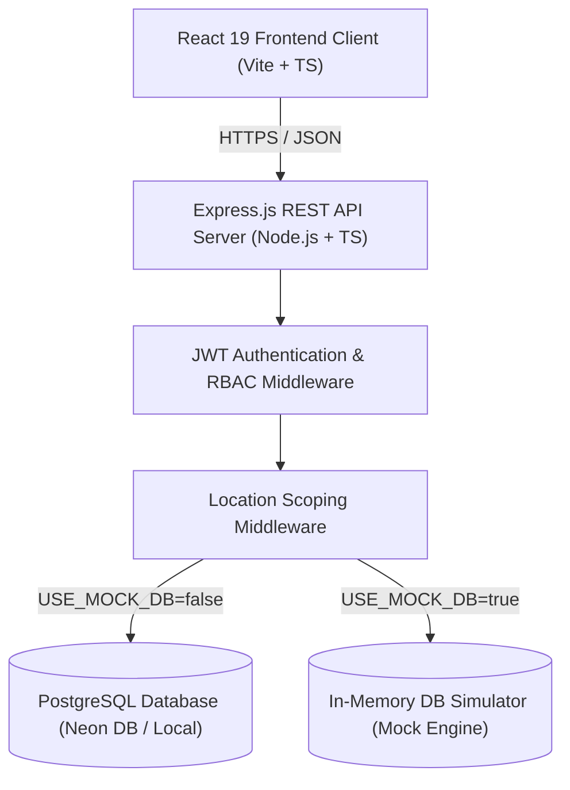
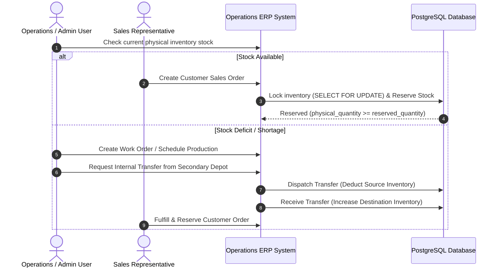

# 🏗️ System Architecture & Design Specification

## Overview

The **Mini Operations ERP** is a full-stack, multi-location supply chain management platform. It coordinates item cataloging, stock levels, work order manufacturing/assembly schedules, internal warehouse stock transfers, and customer sales order fulfillment with atomic inventory reservations.

---

## 🏛️ System Architecture



---

## 🔄 End-to-End Operational Workflow

The application implements the complete operational flow requested by the business case study:

**`Inventory Check` ➔ `Work Order` ➔ `Stock Check` ➔ `Internal Transfer / Shortage` ➔ `Customer Reservation`**



---

## 🛡️ Concurrency Control & Data Consistency

### 1. Atomic Stock Reservations (`SELECT FOR UPDATE`)
When a Sales user creates an order for an item at a specific location and batch, the backend executes an atomic transaction block:

```sql
BEGIN;

-- Lock the target inventory row to prevent concurrent race conditions
SELECT id, physical_quantity, reserved_quantity 
FROM inventory 
WHERE item_id = $1 AND location_id = $2 AND batch = $3 
FOR UPDATE;

-- Validate available stock
-- Available = physical_quantity - reserved_quantity
-- If available < requested_quantity => ROLLBACK transaction

-- Update reserved stock
UPDATE inventory 
SET reserved_quantity = reserved_quantity + $4 
WHERE id = $5;

-- Record reservation in ledger
INSERT INTO inventory_transactions (inventory_id, transaction_type, quantity, created_by)
VALUES ($5, 'ORDER_RESERVE', $4, $6);

COMMIT;
```

### 2. Double-Receipt & Over-Dispatch Locks on Transfers
Internal stock transfers enforce state machine transitions:
- **`REQUESTED`**: Initial state. No stock movement.
- **`DISPATCHED`**: Deducts stock from the source location immediately. Sets `batch` name on the transfer.
- **`RECEIVED` / `PARTIALLY_RECEIVED`**: Adds stock to the destination location based on `received_quantity`. Once received, status locks to prevent duplicate credit.

### 3. Database Engine Safety Constraints
The `inventory` database schema enforces physical invariants:
```sql
CHECK (physical_quantity >= 0)
CHECK (reserved_quantity >= 0)
CHECK (physical_quantity >= reserved_quantity)
```
If an application bug attempts to reserve more stock than physical quantity, PostgreSQL rejects the statement at the database layer.

---

## 🔐 Role-Based Access Control (RBAC) & Location Scoping

| Module / Endpoint | Admin | Operations User | Sales User | Location Lock Rules |
| :--- | :---: | :---: | :---: | :--- |
| **Authentication (`/api/auth`)** | ✅ | ✅ | ✅ | Global access |
| **Items Catalog (`/api/items`)** | ✅ Read/Write | ✅ Read/Write | 👁️ Read-Only | Global access |
| **Inventory (`/api/inventory`)** | ✅ Read/Write | ✅ Read/Write | 👁️ Read-Only | Operations scoped to assigned `location_id` |
| **Stock Adjustment / Damaged** | ✅ Read/Write | ✅ Read/Write | ❌ Blocked | Scoped to user location |
| **Work Orders (`/api/work-orders`)** | ✅ Full | ✅ Progress/Complete | ❌ Blocked | Operations restricted to location |
| **Internal Transfers (`/api/transfers`)**| ✅ Full | ✅ Dispatch/Receive | ❌ Blocked | Source/Destination location gates |
| **Customer Orders (`/api/orders`)** | ✅ Full | ❌ Blocked | ✅ Create/Cancel | Scoped to sales location stock |
