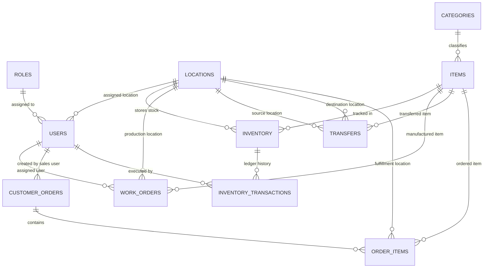

# 🗄️ Database Schema & Entity Relationship Specification

The database is built on PostgreSQL (hosted on Neon Database or local PostgreSQL instance) and enforces foreign key integrity, check constraints, and transaction ledgers.

---

## 📊 Entity Relationship Diagram (ERD)



---

## 📋 Table Definitions

### 1. `roles`
Stores application roles (`ADMIN`, `OPERATIONS`, `SALES`).
```sql
CREATE TABLE roles (
  id SERIAL PRIMARY KEY,
  name VARCHAR(20) UNIQUE NOT NULL CHECK (name IN ('ADMIN', 'OPERATIONS', 'SALES'))
);
```

### 2. `locations`
Physical warehouse or depot locations.
```sql
CREATE TABLE locations (
  id SERIAL PRIMARY KEY,
  name VARCHAR(100) UNIQUE NOT NULL,
  created_at TIMESTAMP DEFAULT CURRENT_TIMESTAMP
);
```

### 3. `users`
System accounts with role and location associations.
```sql
CREATE TABLE users (
  id SERIAL PRIMARY KEY,
  username VARCHAR(50) UNIQUE NOT NULL,
  email VARCHAR(100) UNIQUE NOT NULL,
  password VARCHAR(255) NOT NULL,
  role_id INT NOT NULL REFERENCES roles(id) ON DELETE RESTRICT,
  location_id INT REFERENCES locations(id) ON DELETE SET NULL,
  created_at TIMESTAMP DEFAULT CURRENT_TIMESTAMP
);
```

### 4. `categories`
Item categories (e.g. Electronics, Furniture, Office Supplies).
```sql
CREATE TABLE categories (
  id SERIAL PRIMARY KEY,
  name VARCHAR(100) UNIQUE NOT NULL,
  created_at TIMESTAMP DEFAULT CURRENT_TIMESTAMP
);
```

### 5. `items`
Catalog products with SKUs and unit pricing.
```sql
CREATE TABLE items (
  id SERIAL PRIMARY KEY,
  name VARCHAR(100) NOT NULL,
  sku VARCHAR(50) UNIQUE NOT NULL,
  category_id INT REFERENCES categories(id) ON DELETE SET NULL,
  price DECIMAL(10, 2) NOT NULL CHECK (price >= 0),
  created_at TIMESTAMP DEFAULT CURRENT_TIMESTAMP
);
```

### 6. `inventory`
Tracks physical and reserved stock levels per item, location, and batch.
```sql
CREATE TABLE inventory (
  id SERIAL PRIMARY KEY,
  item_id INT NOT NULL REFERENCES items(id) ON DELETE RESTRICT,
  location_id INT NOT NULL REFERENCES locations(id) ON DELETE RESTRICT,
  batch VARCHAR(50) NOT NULL,
  physical_quantity INT NOT NULL DEFAULT 0 CHECK (physical_quantity >= 0),
  reserved_quantity INT NOT NULL DEFAULT 0 CHECK (reserved_quantity >= 0),
  updated_at TIMESTAMP DEFAULT CURRENT_TIMESTAMP,
  CONSTRAINT unique_item_location_batch UNIQUE (item_id, location_id, batch),
  CONSTRAINT check_reserved_le_physical CHECK (physical_quantity >= reserved_quantity)
);
```

### 7. `work_orders`
Tracks assembly / production work order progress.
```sql
CREATE TABLE work_orders (
  id SERIAL PRIMARY KEY,
  location_id INT NOT NULL REFERENCES locations(id) ON DELETE RESTRICT,
  item_id INT NOT NULL REFERENCES items(id) ON DELETE RESTRICT,
  required_quantity INT NOT NULL CHECK (required_quantity > 0),
  assigned_user_id INT REFERENCES users(id) ON DELETE SET NULL,
  status VARCHAR(20) NOT NULL CHECK (status IN ('ASSIGNED', 'IN_PROGRESS', 'COMPLETED')) DEFAULT 'ASSIGNED',
  created_at TIMESTAMP DEFAULT CURRENT_TIMESTAMP
);
```

### 8. `transfers`
Inter-location inventory movements.
```sql
CREATE TABLE transfers (
  id SERIAL PRIMARY KEY,
  source_location_id INT NOT NULL REFERENCES locations(id) ON DELETE RESTRICT,
  destination_location_id INT NOT NULL REFERENCES locations(id) ON DELETE RESTRICT,
  item_id INT NOT NULL REFERENCES items(id) ON DELETE RESTRICT,
  quantity INT NOT NULL CHECK (quantity > 0),
  received_quantity INT DEFAULT 0 CHECK (received_quantity >= 0),
  batch VARCHAR(50),
  status VARCHAR(20) NOT NULL CHECK (status IN ('REQUESTED', 'DISPATCHED', 'PARTIALLY_RECEIVED', 'RECEIVED')) DEFAULT 'REQUESTED',
  created_at TIMESTAMP DEFAULT CURRENT_TIMESTAMP,
  CONSTRAINT check_diff_locations CHECK (source_location_id <> destination_location_id)
);
```

### 9. `customer_orders` & `order_items`
Sales customer orders with reserved item details.
```sql
CREATE TABLE customer_orders (
  id SERIAL PRIMARY KEY,
  customer_name VARCHAR(100) NOT NULL,
  sales_user_id INT REFERENCES users(id) ON DELETE SET NULL,
  status VARCHAR(20) NOT NULL CHECK (status IN ('PENDING', 'COMPLETED', 'CANCELLED')) DEFAULT 'PENDING',
  created_at TIMESTAMP DEFAULT CURRENT_TIMESTAMP
);

CREATE TABLE order_items (
  id SERIAL PRIMARY KEY,
  order_id INT NOT NULL REFERENCES customer_orders(id) ON DELETE CASCADE,
  item_id INT NOT NULL REFERENCES items(id) ON DELETE RESTRICT,
  location_id INT NOT NULL REFERENCES locations(id) ON DELETE RESTRICT,
  batch VARCHAR(50) NOT NULL,
  quantity INT NOT NULL CHECK (quantity > 0),
  price DECIMAL(10, 2) NOT NULL CHECK (price >= 0)
);
```

### 10. `inventory_transactions`
Audit trail of every stock modification.
```sql
CREATE TABLE inventory_transactions (
  id SERIAL PRIMARY KEY,
  inventory_id INT NOT NULL REFERENCES inventory(id) ON DELETE CASCADE,
  transaction_type VARCHAR(30) NOT NULL CHECK (transaction_type IN (
    'ADJUSTMENT', 'WORK_ORDER', 'TRANSFER_DISPATCH', 'TRANSFER_RECEIVE', 
    'ORDER_RESERVE', 'ORDER_RELEASE', 'ORDER_SHIPPED', 'DAMAGED'
  )),
  quantity INT NOT NULL,
  created_by INT REFERENCES users(id) ON DELETE SET NULL,
  created_at TIMESTAMP DEFAULT CURRENT_TIMESTAMP
);
```
